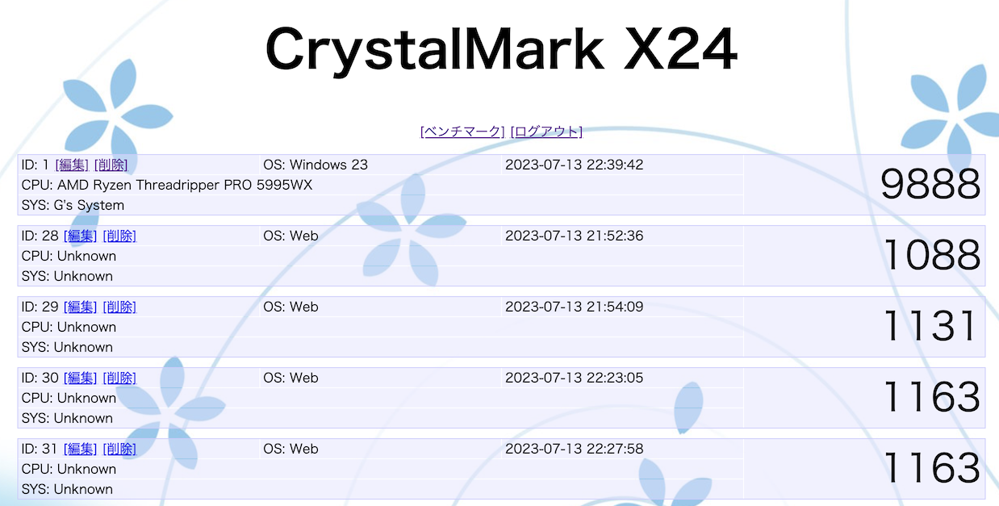

# 課題09 Session機能

 

## ①課題内容（どんな作品か）
- CrystalMark X24 管理者機能搭載版

## ②工夫した点・こだわった点
- 登録したデータの編集・削除機能を管理者でログインした場合のみ使用できるようにしました。
- ログイン画面をメイン画面と同じ雰囲気で作りました。

## ③難しかった点・次回トライしたいこと(又は機能)
- テーブル構成の見直しを行い大量のデータを管理できるようにします。
- ベンチマークスコアでソートする機能や分析する機能を作ります。

## ④質問・疑問・感想、シェアしたいこと等なんでも
参考サイト
- 講義資料
